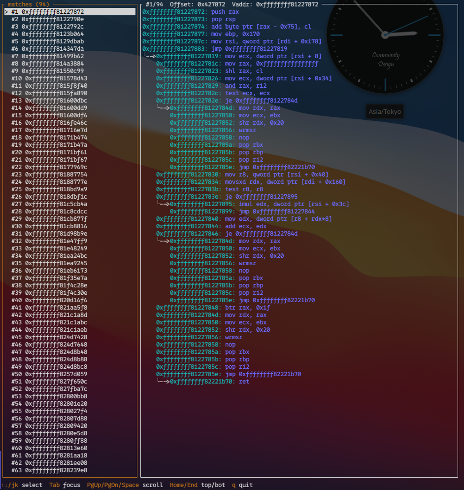
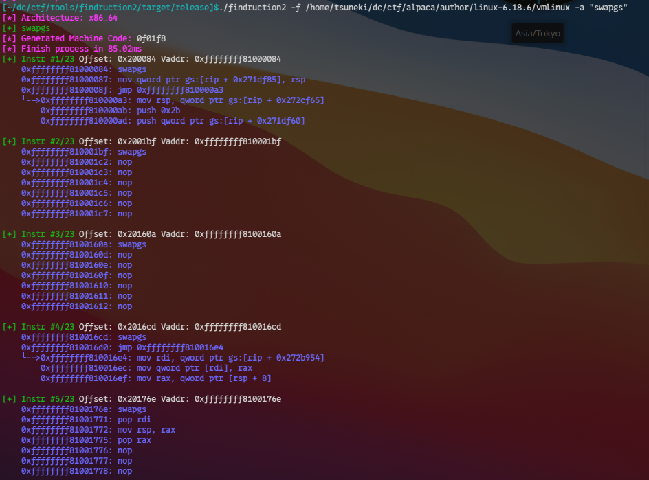
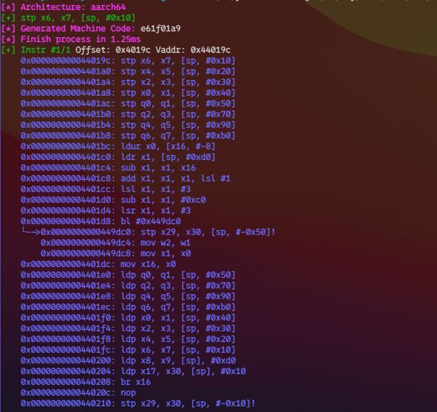

# findruction2



## usage

```shell
$ findruction2 --help
Usage: findruction2 [OPTIONS] --file <FILE> --asm <ASM>

Options:
  -f, --file <FILE>
  -a, --asm <ASM>
  -n, --no-disass
      --arch <ARCH>                  override detected architecture (x86_64|aarch64|riscv64)
      --count <TOP_COUNT>            instructions to show at top level (default 7, 1024 in --tui)
      --branch-count <BRANCH_COUNT>  instructions to show inside a followed branch (default 3, 64 in --tui)
      --depth <DEPTH>                max nested branch depth to follow [default: 2]
  -t, --tui                          open an interactive TUI with no per-line restriction
  -h, --help
  -V, --version
```

## install

```shell
git clone https://github.com/Yayoi-cs/findruction2
cd findruction2
cargo build --release
echo "export PATH=\$PATH:$(pwd)/target/release/" >> ~/.bashrc
```

## example

- swapgs from vmlinux



- aarch64



- tui


